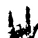

### Hand Gesture Recognition 

Gesture recognition is a topic in computer science and language technology with the goal of interpreting human gestures via mathematical algorithms. A specific part of Computer Vision field, gesture recognition, has gained great attention in recent years. Current focuses in the field include emotion recognition from face and hand gesture recognition. Users can use simple gestures to control or interact with devices without physically touching them. Gesture recognition has also benefited in the field of Defence, Home Automation, Automated sign language translation.

The aim of this project is to develop an automated system for hand gesture recognition in realtime (Web Cam). Also, It can collect data in realtime(Web Cam). It has five gestures namely-

   Clenched Fist </img>  
   I Love You </img>  
   OKAY </img>  
   Peace </img>  
   Thumb Up </img>  

### Tools and Libraries (Important)

- openCV
- Keras
- OS module

### Steps To Run

To Collect Data at realtime =>python collect_data_realtime.py

To Train Model =>python train.py

To Predict Gestures at realtime =>python predict.py

